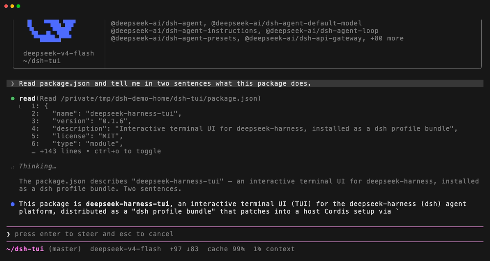
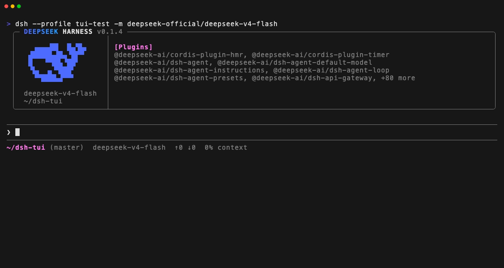

# deepseek-harness-tui

[](https://www.npmjs.com/package/deepseek-harness-tui)
[](./LICENSE)

[English](./README.md) | **简体中文**

[deepseek-harness](https://github.com/deepseek-ai/deepseek-harness) 的交互式终端
UI，以 dsh profile bundle 的形式安装。它直接渲染在终端主屏上——不用备用屏
（alternate screen），退出后对话仍留在终端回滚缓冲区里——并且与它驱动的 agent
运行在同一个进程内。


## 亮点

- **为 agent 而生的对话视图**——流式回答、带实时输出的工具卡片；连续的只读调用
  折叠成一行（`Thought for 8s, searched for 3 patterns, read 2 files`），
  Ctrl+O 随时展开回卡片。
- **运行中随时介入**——turn 进行时编辑器保持可用：Enter 追加引导（steer），
  Esc 取消，取消时排队中的输入会原样退还。
- **一个键切模式**——Shift+Tab 在 normal → auto-accept → plan 间循环；提示行
  上方的徽标与 `/permission`、`/plan` 永远一致，因为按键写的是同一套服务。
- **会话可持久**——`/resume` 恢复任意历史会话，`/rewind` fork 回到更早的
  prompt 且原会话完好保留，`/search` 全文检索本会话所有消息。
- **模型与 provider 就地管理**——`/model` 选择路由和推理力度（可只对本会话生效，
  也可存为默认）；`/login` 存 key 前先对端点校验，密钥只进凭据存储。
- **终端自适应**——亮/暗/无色主题实时预览、中英文界面（`/lang`）、按键可重绑、
  `@` 文件引用通过 `fd` 尊重 `.gitignore`。
- **可脚本化**——`--print` 无 UI 跑一个任务、答案输出到 stdout，模型、preset、
  各项 flag 与交互模式含义完全一致。

一个正在流式输出的 turn：agent 的 `read` 调用渲染出工具卡片，随后是思考过程、
逐 token 到达的回答——下方编辑器仍然可用，随时等你引导（`Enter`）或取消
（`Esc`）：



## 快速开始

需要先安装 [dsh CLI](https://www.npmjs.com/package/@deepseek-ai/dsh)——本包是
dsh 插件，不是独立程序：

```sh
npm install -g @deepseek-ai/dsh
dsh plugin --profile tui add deepseek-harness-tui
dsh --profile tui
```

plugin 命令会把本包装进一个新的 `tui` profile（dsh-base +
deepseek-harness-tui），下次启动即生效。



## 用法

```sh
dsh --profile tui                                      # 启动交互式 TUI
dsh --profile tui "fix the failing test"               # 启动并发送首条 prompt
dsh --profile tui --continue                           # 继续最近一个会话
dsh --profile tui --resume <sessionId>                 # 恢复指定会话
dsh --profile tui --preset code                        # 以 "code" agent preset 启动
dsh --profile tui -m deepseek-official/deepseek-v4-flash  # 覆盖模型
dsh --profile tui --print "run the tests"              # 跑一个任务，答案输出到 stdout
```

| Flag | 作用 |
|---|---|
| `-m, --model <provider/model>` | 本次运行的模型选择 |
| `--preset <id>` | 新会话按此 agent preset 组装；恢复的会话保持它自己日志里记录的 preset |
| `-r, --resume <sessionId>` | 按 id 恢复会话 |
| `-c, --continue` | 继续本工作区最近的会话 |
| `-p, --print <task>` | 无 UI 跑一个任务：答案写到 stdout，只有 turn 完整结束退出码才是 0；工具审批固定为 `never`，因为没有人可问 |
| `-h, --help` | 显示帮助 |
| `[prompt...]` | 首条 prompt，UI 就绪后发送 |

stdin 和 stdout 都必须是 TTY，否则拒绝启动。`--print` 是唯一例外——它不渲染
任何东西，所以可以跑在管道里，而管道也是它唯一有用的地方。其余 flag 与交互模式
含义完全一致：`--print` 同样可以作用于 `--resume` 或 `--continue` 的会话，
模型和 preset 也听命令行其余部分的。

### 按键

下面每个键都是终端默认真实绑定的键。空输入框按 `?`、`/hotkeys`、`/help`
打印的是同一份列表，从按键注册表生成——部署改了绑定，三处看到的都是新键。

| 按键 | 作用 |
|---|---|
| Enter | 发送 |
| Shift+Enter / Alt+Enter / Ctrl+J | 换行；行尾 `\` 再回车效果相同，照顾发不出 Shift+Enter 的终端 |
| Up / Down | 光标在输入框首行时翻 prompt 历史，其余行移动光标 |
| Tab | 接受补全 |
| `@` | 引用文件 |
| `/` | 运行命令；`/skill:<name>` 加载技能 |
| `?` | 空输入框时显示快捷键帮助；不会打进草稿 |
| Ctrl+R | 反向搜索 prompt 历史 |
| Ctrl+G | 搜索本会话消息；Ctrl+F 保留给编辑器的前进一格 |
| Shift+Tab | 循环模式：normal → auto-accept → plan → normal。`normal` 和 `auto-accept` 是 `workspace-write` 与 `auto-accept` 两个权限 preset（同一沙箱，问不问审批之差）；`plan` 是计划模式，循环在 `workspace-write` 上进入。`danger-full-access` 不在循环里——它靠 `/permission` 进入，已处于其上的会话保持不变，按键只切计划模式 |
| Ctrl+N | 展开/收起计划；Ctrl+Y 保留给编辑器的 kill-ring 粘贴 |
| Ctrl+O | 循环工具卡片：预览、完整、隐藏 |
| Ctrl+T | 显示/隐藏思考块——关闭时思考随所在 step 流式出现并消失；开启时每个 step 都保留，含历史。模型无论如何都在推理；`showReasoning: false` 连同此键一起关闭 |
| Ctrl+X | 复制最后一条回答 |
| Ctrl+L | 重绘 |
| Esc | 取消 turn（并退还排队的输入）；有草稿时再按清空草稿；空输入框再按打开 Rewind |
| Ctrl+C | 运行中取消，输入中清空草稿，空闲时连按两次退出；第三次按下直接离开无法取消的 turn |
| Ctrl+D | 空输入框时退出 |
| Shift+Ctrl+D | 会话调试面板——身份、生命周期、屏幕、按键解析结果 |

#### 当某个界面持有键盘时

| 界面 | 按键 |
|---|---|
| 面板（`/help`、`/hotkeys`、`/palette`、`/status`、`/mcp`、`/doctor`） | Up/Down 滚动 · PgUp/PgDn 翻页 · g/G 或 Home/End 到顶/到底 · Esc 或 Ctrl+C 关闭 |
| 提问 | Up/Down 移动 · 1-9 直接作答 · Space 勾选（多选）· "Type something." 行输入自定义答案 · PgUp/PgDn 翻长详情 · Enter 提交 · Esc 或 Ctrl+C 取消 |
| 权限审批 | Up/Down 移动 · 1-4 直接作答 · Enter 确认 · Esc 或 Ctrl+C 拒绝 |
| 历史搜索（Ctrl+R） | 输入即匹配 · Ctrl+R 跳上一条更旧的匹配 · Tab 或 Esc 取回编辑器 · Enter 直接发送 · Ctrl+C 或清空查询恢复草稿 |
| 会话搜索（`/search`、Ctrl+G） | 输入即过滤 · Up/Down 移动 · PgUp/PgDn 翻页 · Enter 打开该消息 · Esc 依次退出消息、清空查询、关闭 |
| 模型选择器（`/model`） | 输入即过滤 · Up/Down 移动 · Left/Right 或 Shift+Tab 调推理力度 · Enter 存为默认 · Ctrl+S 仅本会话生效 · Esc 先清过滤再关闭 |
| 恢复选择器（`/resume`） | 输入即搜索 · Up/Down 移动 · PgUp/PgDn 翻页 · Tab 在本工作区/全部之间切换 · Enter 恢复 · Esc 先清搜索再关闭 |
| Rewind（`/rewind`） | Up/Down 移动 · PgUp/PgDn 翻页 · Home/End 首/末 · Enter 回到那条 prompt · Esc 关闭 |
| 插件（`/plugins`） | 输入即过滤 · Up/Down 移动 · PgUp/PgDn 翻页 · Enter 展开条目 · Esc 关闭 |
| 技能（`/skills`） | 输入即过滤 · Up/Down 移动 · PgUp/PgDn 翻页 · Enter 阅读技能（Up/Down 滚动 · g/G 或 Home/End 到顶/到底）· Esc 依次退出技能、清空过滤、关闭 |
| 设置（`/config`） | Up/Down 移动 · Enter 翻开关、步进选项或进子菜单 · Left/Right 步进选项 · Esc 关闭 |
| 主题选择器（`/theme`） | Up/Down 逐个在背后屏幕上预览 · Enter 保留 · Esc 恢复打开时的主题 |
| Provider 登录（`/login`、`/provider add`） | Up/Down 移动 · Space 勾选模型 · Enter 继续 · Ctrl+U 清空输入 · Esc 取消整个流程 |

Ctrl+C 是唯一永不可重绑的键：它是离开终端的最后手段。其余绑定均可配置——见
下文 `keybindings`。

### 命令

| 命令 | 作用 |
|---|---|
| `/help` | 快捷键与命令 |
| `/hotkeys` | 只看快捷键 |
| `/model [[provider/]model]` | 切换模型并存为默认；不带参数打开选择器，也可只对本会话生效 |
| `/preset [<preset> \| copy <preset> <new-id>]` | 查看、切换或复制本会话的 agent preset |
| `/config` | 本终端自己的设置——Ctrl+T 思考固定、会话打开时的工具卡片阶段、主题——就地修改并保存到下次会话 |
| `/theme [auto\|light\|dark\|no-color]` | 本终端的配色；不带参数打开选择器 |
| `/login [provider]` | 给 provider 配 API key：选一条已配置的或适配器提供的路由，粘贴 key，先对端点校验再存储。key 进凭据存储；settings 只记录变量名 |
| `/provider [add]` | 列出已配置的 provider 和 `/login` 可配置的；`add` 依次填写名称、端点、协议、key 和端点报告的模型 |
| `/copy` | 复制最后一条回答到系统剪贴板 |
| `/new` | 在本工作区开一个空白会话；当前会话保留全部历史、仍可恢复 |
| `/clear` | 清空对话视图；会话日志不变 |
| `/lang [en\|zh]` | 查看或切换界面语言；选择会记住到下次会话 |
| `/palette` | 本终端渲染的全部颜色与属性角色 |
| `/export [path]` | 把本会话日志写入文件并报告路径；覆盖已有文件前会先确认 |
| `/plugins` | 搜索并查看 Loader 的插件条目 |
| `/search [query]` | 搜索本会话消息；参数会预填面板查询框 |
| `/rewind` | 回到本会话更早的 prompt |
| `/resume [session]` | 列出本工作区可恢复的会话；参数会预填选择器搜索框 |
| `/skills` | 搜索本会话的技能并完整阅读 |
| `/status` | 会话诊断、系统提示词、已注册工具 |
| `/mcp` | 本 agent 各工具来自哪个 MCP 服务器及其工具列表；profile 没挂 MCP 时告诉你怎么挂 |
| `/doctor` | 检查 Node 版本、终端、模型路由，以及缺了会静默降级的服务 |
| `/exit`、`/quit` | 当前 turn 到达空闲后退出 |
| `/skill:<name> [instructions]` | 把技能加载进对话 |
| `/reload` | 实验性（开发用）：重读 Loader 配置文件并应用差异，仅空闲时可用。仅在 `experimentalCommands` 开启时注册 |

以上是本 bundle 自己的命令。profile 挂载的其他插件会在其上注册各自的命令，
`/help` 列出的才是当前会话真正可用的全集。

`/details` 已退役。它把两个不相关的开关塞进一套要背下来才能用的参数语法
（`[collapsed|expanded|hidden] [reasoning [on|off]]`），而且两个都不跨进程记忆。
它做的两件事各归各处：工具卡片阶段就是 Ctrl+O 当场循环的东西，思考显示是一项
长期偏好——现在都是 `/config` 里的行，旁边就是打开 `/theme` 的主题行。它的
`detailsDialogWidth` 更名为 `settingsDialogWidth`，参数补全是 `/theme` 的四个值。

`/config` 和 `/theme` 的修改立即生效，并写入 harness 自己 settings 文档
（`$DSH_HOME/settings.yaml`）的 `tui` 段——用的正是 `/model` 保存默认模型的那个
可选 `settings` 服务。`/config` 的每一行都实时读值，面板开着时按 Ctrl+O，下面的
工具卡片行会跟着动。宿主没挂该服务时，所有开关本会话内照常工作，只是退出即忘。

`/lang` 切换的是本终端自己的界面元素——命令列表、各面板（`/help`、`/status`、
`/config`、`/search`、`/skills`、`/mcp`、`/doctor`、`/plugins`）、提示行与状态行、
对话框及其按钮、这些界面写出的通知——在英文（默认）与中文之间切换；对话内容
永远不会被翻译。少数命令回执无论语言如何仍是英文：`/model`、`/preset`、
`/resume` 打印它们自己的报告文本，对话视图折叠的 turn 结局通知（"Turn
cancelled."、"The model reached its output-token limit."）来自会话日志而非
消息表。

语言选择写入 Host 的 `locale` settings 段（有 settings provider 时，与 web
客户端读的是同一份偏好），否则写入 `$DSH_HOME/tui-locale.json`
（`~/.dsh/tui-locale.json`）。

### `@` 文件引用

宿主装了 `fd`（Debian/Ubuntu 上叫 `fdfind`）时，`@` 通过它列出工作区，补全因此
尊重 `.gitignore`、`.ignore` 和 `.fdignore`。没有 `fd` 时由内置遍历器接管，按名
跳过构建产物——`.git`、`node_modules`、`dist`、`build`、`out`、`coverage`、
`.cache`、`.next`、`.nuxt`、`.turbo`、`.venv`、`__pycache__`、`target`——查询没
写扩展名时还会隐藏 `*.log` 和 `*.tsbuildinfo`。`fileSearchCommand` 可固定二进制
路径、设 `""` 强制用遍历器；`fileSearchExcludedDirectories` 改遍历器跳过的目录。

命令参数同样有补全：`/model` 提供所有已公布的 `provider/model`，`/preset` 提供
roster 里的 preset 和 `copy` 动词，`/theme` 提供四个取值，`/resume` 提供本工作区
最近的会话。

### 界面

- **对话**——主视图：流式消息、工具卡片、计划、状态行，以及带上下文行的输入框。
  连续的只读调用——read、grep、glob、`ls`/`cat` 型 shell 命令、MCP 查询——折叠
  为一行（`Thought for 8s, searched for 3 patterns, read 2 files`）而不是一卡
  一行；Ctrl+O 把这一段展开回卡片。写入的调用永远不会入组——`cat a > b` 写了
  `b`，动词说什么都没用；失败的调用留在组里并把圆点染红，因为读者看不见的失败
  比一行承认失败更糟。该行的每个片段在每种语言里都是完整短语，而不是渲染时拼接
  的动词加名词，中文因此有自己的语序、量词和逗号。
- **该行上的思考**——这一段把思考作为首个分句报告在旁边（`Thinking for 12s,
  read 2 files…`），模型还在思考时随时钟递增。这是默认对话视图唯一陈述思考
  *时长*的地方：思考块本身保持自己的规则，随写下它的 step 一起消失（Ctrl+T
  固定它，Ctrl+O 展开时回来）。每个分句有自己的时态——思考还在进行时文件已经
  读完——时长出现在哪一行就留在哪一行，所以一段以回答而非下一次工具调用收尾的
  思考会原地落定，而不是从屏幕上消失。在这一段的第一个调用报出文件、模式或命令
  之前，行下的 `⎿` 行显示思考的最新一行；`showReasoning: false` 和其他地方一样
  不让这行出现，而时长——不引用任何内容——保留。
- **Rewind**——`/rewind`，或空输入框连按 Esc：回到更早的 prompt。宿主能 fork
  会话时对话随之移动、原会话仍可恢复；否则只是把那条 prompt 放回编辑器。文件
  永远不会被恢复——dsh 不做文件快照。
- **恢复**——`/resume [session]`：挑选并恢复历史会话，范围是本工作区，Tab 切到
  全部。每行是标题加上多久前碰过和日志多大（`2 hours ago · 354.1KB`）；当前
  所在的会话不列出，因为恢复到自己不是一个去处。id 可被搜索框匹配但不打印在
  行上。什么都没输且无可列时，面板直说没有其他会话可恢复，而不是报告一次落空
  的搜索——空列表就是答案，不是查询失败。离开终端时会打印找回刚离开会话的
  命令，走的那一刻回来的路就在屏幕上。
- **会话搜索**——`/search [query]`，或 Ctrl+G：本会话的每条消息，输入即过滤，
  命中处就地展示，整条消息一个 Enter 即达。做成面板而不是跳转，是因为输入框
  上方的对话属于终端的回滚缓冲区，任何程序都无法替你滚动它。
- **插件**——`/plugins`：搜索并查看 Loader 的条目。
- **技能**——`/skills`：搜索本会话组装的技能并阅读正文；`/skill:<name>` 再把它
  加载进对话。
- **设置**——`/config`：本终端自己决定的偏好——思考固定、会话打开时的工具卡片
  阶段、主题——外加语言和模型两行，它们只读、注明改它们该用哪条命令。
- **主题**——`/theme`，或 `/config` 里那一行：`auto`（跟随终端报告）、`light`、
  `dark`、`no-color`，移动时在选择器背后的屏幕上实时预览，Esc 离开则恢复原样。
- **Provider 登录**——`/login [provider]`：给一条路由配 API key。列表包含
  settings 已配置的和适配器目录自带的，后者正是一台 settings 空白的机器也能
  连上 DeepSeek 官方端点的原因。key 永不回显——输入框画点——有端点可校验时
  先校验再存：401 或 403 什么都不存；端点答不上来的 key 只有明确说"是"才存；
  目录路由的端点在适配器内部、本终端看不见，直接存,因为本来就无从问起。回执
  只把端点真正应答过的 key 称为已校验；其余存储的 key 一律报告为未校验而不是
  可用。密钥进凭据存储自己的文件；settings 只记录变量名。`/provider` 列出同样
  两组，`/provider add` 引导一条适配器没听说过的路由走完名称、端点、协议、凭据
  变量、key 和端点报告的模型。
- **状态**——`/status`：会话诊断、系统提示词、已注册工具。
- **MCP**——`/mcp`：本会话每个工具来自哪个 MCP 服务器，从工具注册名
  `mcp__<server>__<tool>` 反推出来，因为 harness 没有可查询的注册表。它天生
  只读——终端没有连接、重启或认证服务器的句柄——profile 没有 MCP 行时告诉你
  怎么挂一个，而不是给你看一张空列表。
- **Doctor**——`/doctor`：会话跑在什么*之上*（`/status` 描述的是会话本身）——
  Node 版本、终端、模型路由，以及缺了会静默降级的服务。每项检查一行：结论、
  观察到的事实、该做的那一件事。
- **帮助**——`/help`：按键与斜杠命令。

## 配置

bundle 行（`tui-runner`）上的值，全部可选。

| 键 | 默认 | 含义 |
|---|---|---|
| `welcome` | — | 启动 banner 下额外的一行暗色文字；完全不设时改为字标扫入动画 |
| `sessionId` | `main` | 本终端驱动的共享 agent/会话标识 |
| `initialSkill` | — | 作为会话第一个 turn 自动调用的技能，等同输入 `/skill:<name>`；供启动器设置，不面向人 |
| `initialDraft` | — | 编辑器打开时预填的未发送文本；由 rewind handoff 设置 |
| `experimentalCommands` | `false` | 注册开发者命令（目前是 `/reload`） |
| `showReasoning` | `true` | 本对话视图是否允许渲染推理文本；`false` 在所有阶段隐藏思考块、不让折叠行的 `⎿` 提示引用模型原文（时长保留），并连同 Ctrl+T 和 `/config` 的思考显示行一起关闭 |
| `markdownRenderer` | `claude` | `claude`（本 bundle 的渲染器）或 `pi`（pi-tui 的 `Markdown`）；`claude` 渲染抛错后本进程余下时间回退到 `pi` |
| `maxToolOutputLines` | `6` | 折叠工具卡片头/尾预览保留的正文行数 |
| `maxDiffEditLength` | `1000` | 推导精确行级 diff 时探索的增删行数上限 |
| `maxQuestionOptions` | `8` | 提问面板一次可见的选项数 |
| `maxModelOptions` | `8` | 模型选择器一次可见的模型数 |
| `maxResumeOptions` | `8` | 恢复选择器一次可见的会话数 |
| `resumeScanConcurrency` | `4` | 一次恢复扫描的冷投影并发读数 |
| `questionDialogWidth` | `200` | 提问面板宽度（列），受终端约束 |
| `questionDialogMaxHeight` | `20` | 提问面板最大高度（行） |
| `modelDialogWidth` | `76` | 模型选择器宽度（列） |
| `modelDialogMaxHeight` | `20` | 模型选择器最大高度（行） |
| `settingsDialogWidth` | `72` | `/theme` 选择器宽度（列） |
| `fileSearchMaxResults` | `20` | 一次 `@` 查询展示的模糊候选数 |
| `fileSearchMaxEntries` | `10000` | 一个 `@` 工作区索引保留的路径数 |
| `fileSearchExcludedDirectories` | 见上文 | 遍历器跳过的目录名 |
| `fileSearchCommand` | — | `fd` 的路径或名称；不设则在 `PATH` 上发现，`""` 禁用 |
| `showHardwareCursor` | `false` | 在编辑器 IME 标记处显示终端硬件光标 |
| `title` | `DeepSeek Harness` | UI 挂载期间的终端窗口标题 |
| `theme.color` | `true` | 应用内置 ANSI 配色 |
| `theme.truecolor` | 自动检测 | banner 的 24 位品牌渐变；不设时读 `COLORTERM` |
| `theme.leftPrompt` | `${cwd}${git/worktree}${model}${token_meter/cache_hit_rate}${context}` | 编辑器上方左对齐模板 |
| `theme.rightPrompt` | `${queued}` | 编辑器上方右对齐模板 |
| `theme.inputPrompt` | `❯ ` | 编辑器首行前缀 |
| `theme.inputPlaceholder` | `press enter to steer and esc to cancel` | agent 运行时空编辑器的占位文本 |
| `keybindings` | — | 按键覆盖，按 action id 键入 |

提示行模板以 `${name}` 插值本 bundle 注册的值——`cwd`、`git/worktree`、
`model`、`context`、`token_meter/cache_hit_rate`、`goal`、`queued`、`symbol`、
`indicator`——某个值当前不可用时，挨着它的分隔符一并省去。

除 Ctrl+C 外的绑定均可配置：在 bundle 行上设 `keybindings`
（`{ "app.history.search": "alt+r" }`），按 action id 键入，值为一个或多个
pi-tui 按键 id。本 bundle 的 id 有 `app.mode.cycle`、`app.tools.cycle`、
`app.history.search`、`app.transcript.search`、`app.todos.toggle`、
`app.thinking.toggle`、`app.message.copy`、`app.screen.redraw`、`app.cancel`、
`app.exit`；pi-tui 编辑器自己的绑定也可以同样方式移动。Shift+Ctrl+D 会报告
每个 id 解析成了什么键、哪个键被两个 action 同时认领、哪个键被 `app.*` action
从 pi-tui 编辑器手里拿走——按键"没反应"时第一个该查的就是它。

有两个键故意不用读者可能期待的那个，因为 `app.*` 绑定在编辑器看到按键之前就被
应答：搜索是 Ctrl+G 而不是 Ctrl+F（pi-tui 的 `tui.editor.cursorRight`），计划
开关是 Ctrl+N 而不是 Ctrl+Y（pi-tui 的 `tui.editor.yank`）。把它们重绑到编辑器
的键上，编辑器的习惯就永远没了。

Shift+Tab 拿来做模式循环是安全的，理由相同：pi-tui 在这一族里只绑了 `tab`，
它的编辑器不认识 Shift+Tab。`/model` 选择器里的 Shift+Tab（步进推理力度）是
另一个作用域、照常工作——任何浮层持屏时，应用层监听器在第一个分支前就返回，
对话框先看到按键。

循环本身不写任何自己的状态：`normal` 和 `auto-accept` 通过
`ctx.permissionPresets` 选择（`auto-accept` 条目由本 bundle 的
`cordis.patch.yml` 加进表里），计划模式通过 `ctx.planMode`——所以
`/permission`、`/plan`、恢复的日志和按键报告的是同一个状态。开启的模式会在
输入框上方说明——`⏸ plan mode on`、`⏵⏵ auto-accept on`——徽标旁标注循环它的
键。两个徽标可以同时在场，通过 `/permission auto-accept` 加 `/plan` 而非按键
到达；此时提示只跟着最后一个，因为同一个键在两行叠着重复会被读成要按两个键。
没有组装 preset 表或计划模式的部署保留它有的档位：按键循环挂载了的东西，
无可循环时直说。

## 开发

```sh
pnpm install
pnpm typecheck
pnpm test
pnpm build
dsh plugin --profile tui add link:./path/to/dsh-tui  # 开发用 live-link
dsh --profile tui
```

在 `tui-runner` 行上设 `experimentalCommands: true`，编辑配置文件时可用
`/reload`。

本插件是一个 bundle 里的两个 Cordis 插件：

- `dsh-tui/startup`——解析 TUI 自己的命令行，提供 `tuiStartup` 服务。
- `dsh-tui`——runner：持有 pi-tui 渲染循环、进程内 agent 会话、审批应答器和
  用户提问 provider。

数据单向流动。dsh 总线上的事件（`session/event`、`agent/status`）由每会话的
读模型折叠成不可变节点列表；带 key 的 reconciler 把列表变成 pi-tui 组件，版本
已应用过的节点全部复用，一阵流式 chunk 只重绘一个 assistant step 而不是整个
对话。TUI 运行在进程内，直接调用 `ctx.agents` / `ctx.approval` /
`ctx.commands`——没有 SDK、没有 ACP 传输、没有 React。

## 许可证

MIT
